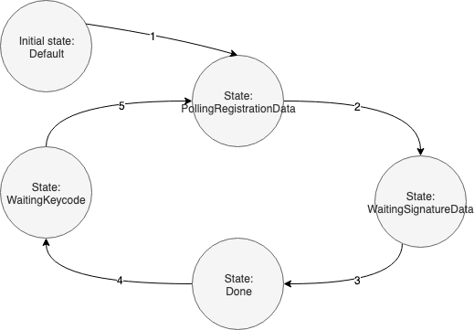

# Overview

This document describes the state flow of the keycode handling in [controller](../../../pkg/controller/alamedaservicekeycode/alamedaservice_controller.go).

# Normal tate flow 

1. User fills keycode into AlamedaService and Federatorai-Operator successfully sends the keycode into KeycodeRepository.
2. Federatorai-Operator successfully polls the registration data from KeycodeRepository.
3. User fills signature data into AlamedaService and Federatorai-Operator successfully sends the data into KeycodeRepository.
4. User deletes keycode from AlamedaService.

# Add keycode that has been registerd

If the applied keycode has been activated, controller will put registration data into AlamedaService.Spec.Keycode.SignatureData and mvoe the current state from PollingRegistrationData to Done immediately.
 